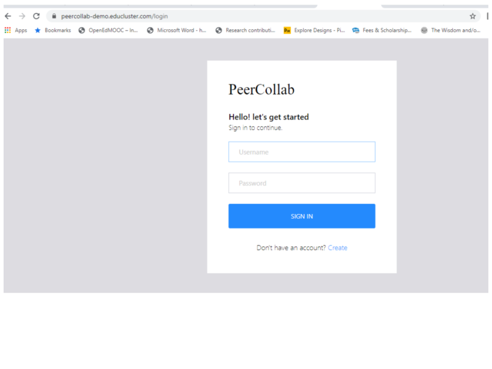

# PeerCollab: Scaling online social presence with rapid communities 

Massive Open Online Courses (MOOCs) often lack valuable social presence in the courses. We know social presense contributes to higher gains in learning experience. MOOCs platforms do provide forums, however these often scaffold cognitive presence in the interactions, as opposed to social presence. Unlike in small, closed learning environments, MOOCs face challenges of scale, and social diversity when trying to support social presence. 
We present PeerCollab system based on the pedagogical framework presented in [research](https://ieeexplore.ieee.org/document/8363324 ) which has 4 phases: Cluster, Orient, Focus and Network to scaffold better social interaction in MOOCs. The framework leverages clustered groups with a community leader facilitating the conversations leading social presence. It also enables scaling social presence in MOOC forums to resemble a small community.

The concept of PeerCollab has been stimulated using the OpenSAP cuourse - Object-Oriented Programming in Java by Christiane Hagedorn, Ann Katrin Kuessner, Thomas Staubitz, Ralf Teusner - [Link](https://open.sap.com/courses/java1/)

<h2>How to use</h2>

<ul>
  <li>
    Log or Create a User Name
  </li>
  <li>
    Join a Course 
  </li>
  <li>
    Create a community or join a community 
  </li>
  <li>
    Learn with your Group
  </li>
</ul>
